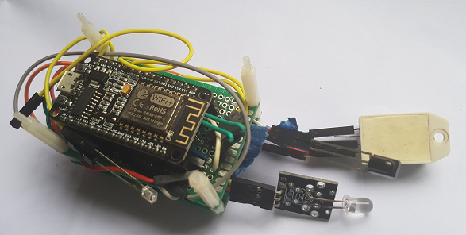
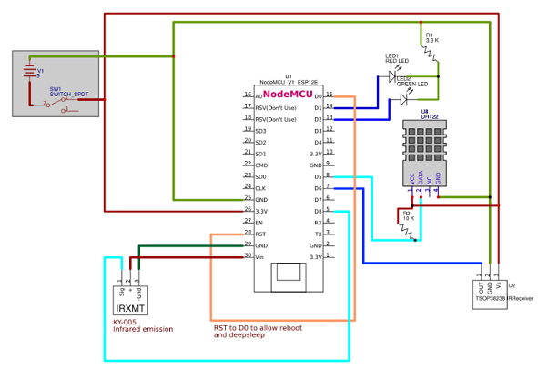

# HiveBot MicroClimate IOT Device
Project for ES8266 NodeMcu 12e MicroController. Device to join as Client BOT for **HiveCentral**. 
HiveBot has sensors for Temperature & Humidity using DHT22 and Infrared Transreciver to listen to IR 
Signals sent to AirCon and send Signals to aircon. 



## Features
  - MQTT Connectors to talk with **HiveCentral**
  - Function : DHT22 Sensors for Temperature and Humidity 
  - Function : IR Signals from Aircon
  - Function : DeepSleep for PowerSaving mode.
  - Function : LEDs red/green for connection mode.
  - Enable/disable Functions independently from HiveCentral
  - Integrate **WifiManager** for easy Wifi & Application Configuration 

## Power Consumption 
1 x Lithium Ion 18650 (3.7 v) Tested Running time : 50 Hours 
```
USB Power Measure : 5.05 v
DeepSleep 	.009 A, .045W
Running 	.080 A, .392W

18650 Power Measure : 3.7 v
DeepSleep 	.008 A, .029W
Running 	.080 A, .296W
```

  
  
## Libraries & Resources
 - [WifiManager](https://github.com/tzapu/WiFiManager)
 - [MQTT PubSubClient](https://pubsubclient.knolleary.net/)
 - [ArduinoJson](https://arduinojson.org/?utm_source=meta&utm_medium=library.properties)
 - [DoubleResetDetector](https://github.com/datacute/DoubleResetDetector)
 - [IRremoteESP8266](https://github.com/markszabo/IRremoteESP8266/wiki#ir-receiving)




## Configuring to join HiveCentral Network.
Setting up BOT to join a new Wifi AccessPoint and HiveCentral MQTT Cluster.
 - Double tap the 'RSET' button on the NodeMcu 12e to switch to **ConfigMode**  
 - BOT will restart in **AP (Soft Access Point Mode)** Mode and start new WIFI AccessPoint "HIVE_BOT_ID" 
 - Connect to Wifi AccessPoint and access **WifiManager** page http://192.168.4.1 to configure
 - BOT will restart and connect to Wifi, if not sucessfull will fallback to **ConfigMode** 

Known Issue : You may need to to toggle different AccessPoint 

